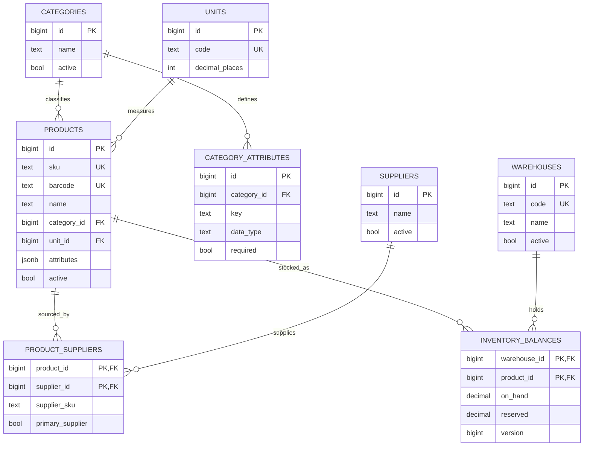
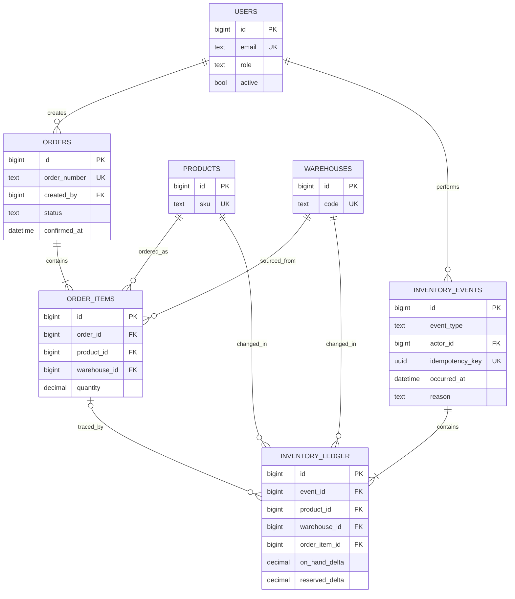
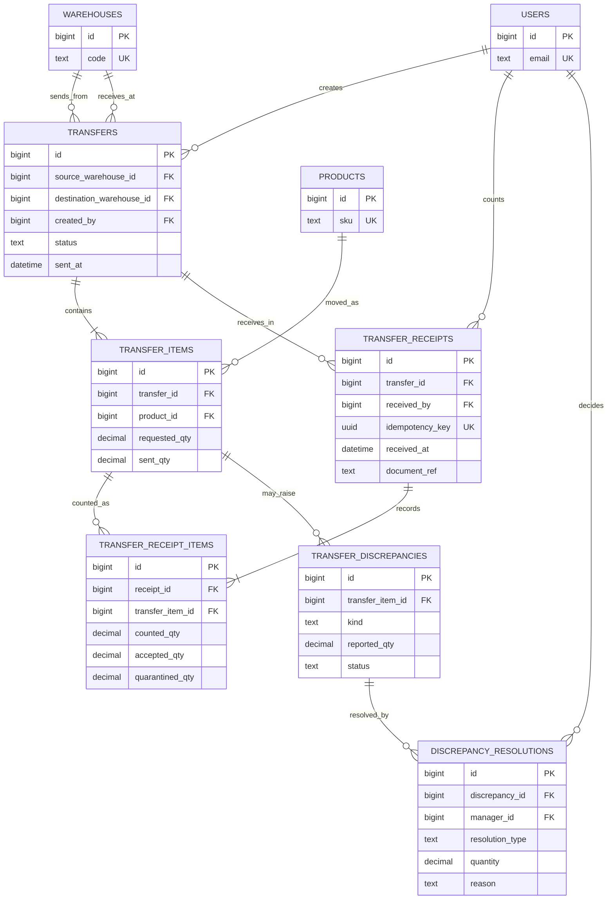

# OrderFlow system design and logical ERD

Status: reviewed and approved by the user as the logical design for OrderFlow.

The diagrams show the agreed relationships and important columns. The physical schema is implemented in [the database migrations](../server/migrations/001_schema.sql). Migrations 005 and 006 move stock commands into the backend while retaining database integrity guards. See the [backend guide](../server/README.md) for the running API and the [database guide](database-guide.md) for the original SQL design.

## System shape

The browser uses a React application to call an Express API. PostgreSQL holds users, catalog data, balances, orders, transfers, and immutable stock history. The API commits a business change and its ledger, audit, and in-app notification records together. A separate worker handles imports and exports. An open browser can use the notification event stream to refresh its stored feed. Browser push and external notification delivery are optional later integrations.

The key distinction is between **current state** and **history**:

- `inventory_balances` answers how much accepted stock is on hand and reserved in each warehouse.
- `inventory_events` groups one business action, such as confirming an order or sending a transfer.
- `inventory_ledger` records each stock change caused by that action and is never edited or deleted.
- Transfer quantities that are unresolved in transit or physically quarantined are tracked separately. They are unavailable for orders.

## 1. Catalog and warehouse ERD

`sku` is unique across the company. `barcode` is unique when present; several products may have no barcode. Product name, SKU, barcode, and category are the first search fields. Category attributes are validated against `category_attributes` but are not general search filters in the first version. Product prices and supplier costs use exact decimal values plus a currency code; amounts in different currencies stay separate.

`inventory_balances` has one row per existing product/warehouse combination. `on_hand` means **accepted stock recorded in that warehouse**, not goods still in transit or unverified excess. Its constraints are `on_hand >= 0`, `reserved >= 0`, and `reserved <= on_hand`. Available stock is `on_hand - reserved`. The combination `(warehouse_id, product_id)` is unique.

## 2. Orders and stock history ERD

An order can have multiple items, and each item names its fulfillment warehouse. The same product/warehouse pair appears at most once within an order. A draft has no reservation. Confirming the order locks or conditionally updates all affected balance rows in a stable order, verifies every quantity, reserves all lines, and adds the event and ledger rows in **one transaction**. If one line cannot be reserved, the transaction rolls back. Repeating the confirmation with the same idempotency key returns the original result without another reservation. PostgreSQL row locking and constraints support these guarantees; automatic reservation by itself would not prevent a race. [PostgreSQL locking](https://www.postgresql.org/docs/current/explicit-locking.html), [constraints](https://www.postgresql.org/docs/current/ddl-constraints.html).

For an order quantity `q`, the ledger uses these deltas:

| Action | `on_hand_delta` | `reserved_delta` | Result |
| --- | ---: | ---: | --- |
| Confirm | 0 | `+q` | Stock is held. |
| Cancel before fulfillment | 0 | `-q` | The hold is released. |
| Fulfill | `-q` | `-q` | Held stock leaves the warehouse. |
| Accept return | `+q` | 0 | Returned stock is received through a new event. |

The event and ledger carry the actor, timestamp, reason, and source link. Ledger rows also store before and after values or enough immutable data to reconstruct them. An order has an explicit status transition; cancelling or fulfilling the same confirmed order twice is rejected or returns its previous result. A separate `order_returns` and `order_return_items` pair links partial or full returns to the original order items and prevents returning more than was fulfilled.

## 3. Transfers and discrepancies ERD

Sending a transfer deducts source `on_hand` and records the sent quantity. Receiving records what was physically counted. Only the accepted quantity is added to destination `on_hand`. A shortage stays unresolved in transit and unavailable at both warehouses; a later delivery may reduce it. Excess is recorded as quarantined/unidentified quantity and is also unavailable. Outstanding transit is derived from sent quantity minus accepted receipts and approved shortage or dispatch corrections. These quantities are derived from immutable send, receipt, and resolution records rather than silently adjusting a balance.

The transfer is marked disputed when source and destination counts differ. A manager reviews signed documents or photos, sender and receiver IDs, timestamps, and audit events. The manager can record a later receipt, recognized loss, corrected dispatch, or verified excess. Each decision has a reason and a linked inventory event when stock changes. The original send and receipt remain visible. A transfer cannot be closed while an unresolved quantity remains.

## Supporting records

| Area | Tables and relationship |
| --- | --- |
| Authentication | `sessions` belongs to `users`; only token hashes are stored. |
| Approvals | `stock_change_requests` belongs to a requester and optionally a reviewer; it covers damage/loss, stock counts, and reversals. Approval links to the posted `inventory_event`. |
| Receipts/opening stock | `receipts` and `receipt_items` describe incoming quantities; posting creates inventory events and ledger rows. |
| Returns | `order_returns` and `order_return_items` link accepted returns to fulfilled order items. |
| Notifications | `notifications` belongs to a user; `user_notification_preferences`, `push_subscriptions`, and `telegram_links` control optional delivery. |
| Background work | `outbox_events`, `background_jobs`, `import_jobs`, and `export_jobs` provide durable, retryable work; notification delivery attempts are recorded separately. |
| Audit | `audit_events` records administration, approvals, and status changes that do not necessarily change stock. |

Every stock-changing event must link to its business source. The physical schema should use typed foreign keys or typed link tables for orders, transfers, receipts, returns, and approved requests, rather than relying on an unchecked `source_type/source_id` pair. `inventory_events.idempotency_key` is unique for a committed command, and each event's ledger rows are written in the same transaction.

## Rules the schema must enforce

- IDs are stable; business references such as order number and SKU have their own unique constraints.
- Posted ledger, transfer send, receipt, and resolution facts are append-only. Corrections create new linked facts.
- Amounts and quantities use exact decimal types. Units specify allowed precision; currency is stored with each money amount.
- Stock balances never become negative and reservations never exceed accepted on-hand stock.
- A transfer's source and destination warehouses must differ.
- Repeating a receipt request cannot accept its lines twice; a separate, legitimate later receipt may accept more of the same transfer item. Accepted plus quarantined quantities must equal the recorded count for each receipt line.
- A stock count approval recalculates its proposed difference against the current balance. If stock changed after the count, the manager must review the new difference before posting.
- An adjustment or reversal changes a balance only after manager approval. Decisions and reasons remain in the audit trail.
- Searches and reports read balance summaries and indexed history; they do not calculate the entire ledger for every screen load.

The physical schema expands this logical diagram in several places: approval requests and immutable decisions have separate tables; discrepancy status is derived by a view from reports and resolutions; and events carry typed source foreign keys. The backend now calculates ledger before/after values and updates current balances in the same transaction. Database triggers still validate product attributes and protect posted history and document/event consistency. Subsequent schema changes belong in new migration files.
